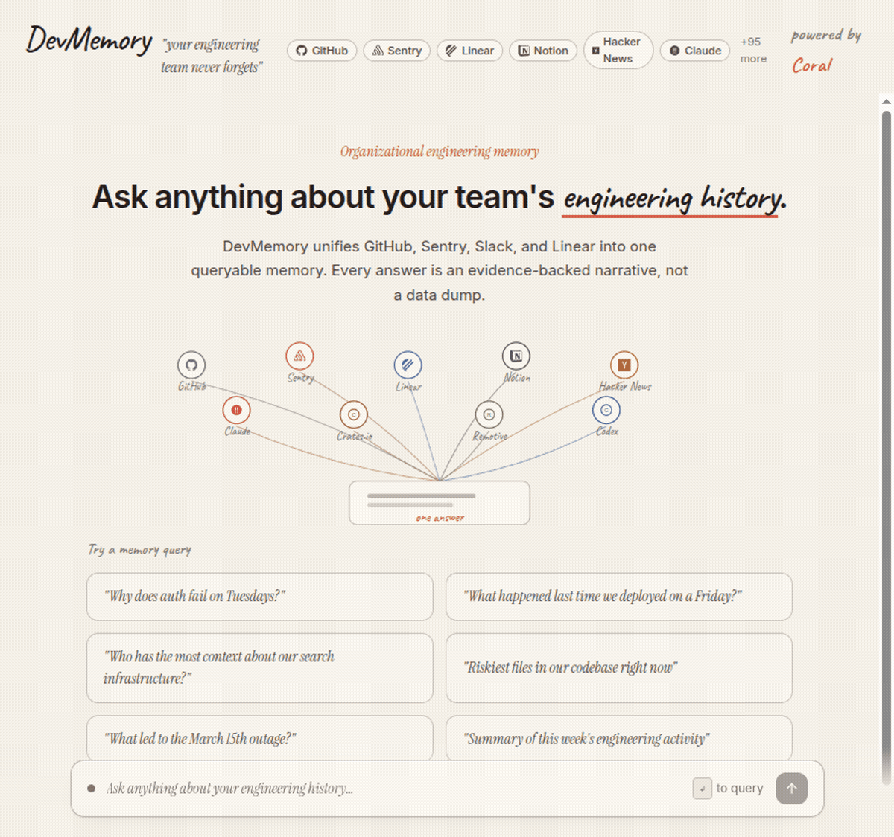

# DevMemory

**Your engineering team never forgets.**

<!-- TODO: Replace with your recorded GIF -->


> Ask any question about your engineering history. DevMemory queries across 9 data sources in one Coral SQL statement and returns an evidence-backed narrative, not a data dump.

**[Live Demo](https://coralhackathon.vercel.app)** · **[YouTube Demo](https://youtube.com/watch?v=TODO)** · Track 1: Enterprise Agent

---

## Why

Context switching costs **$50K per developer per year**. Knowledge is scattered across GitHub, Sentry, Linear, Notion, Slack. When someone leaves or forgets a decision, that context is gone.

DevMemory fixes this. One question, one SQL query across all your tools, one answer with receipts.

---

## Coral Features Used

> *"The more Coral features you use, the better your chances."*

- **SQL Interface** - every answer starts with a Coral SQL query executed via CLI
- **Cross-Source JOINs** - `JOIN linear.issues WITH sentry.issues` in a single statement
- **Schema Learning** - agent discovers available tables via `coral.tables` before querying
- **Caching** - execution time tracked per query, cache hits detected automatically
- **MCP Integration** - `mcp-config.json` ships with the project for Claude Code / Cursor

---

## 9 Sources Connected

GitHub · Sentry · Linear · Notion · Hacker News · Claude · Crates.io · Remotive · Codex

All queryable through Coral's unified SQL interface. Cross-source JOINs work across any combination.

---

## How It Works

```
"Why does auth fail on Tuesdays?"
        |
        v
   LLM generates Coral SQL
        |
        v
   Coral executes across sources
   GitHub + Sentry + Linear + Notion + ...
        |
        v
   LLM synthesizes narrative + evidence
        |
        v
   UI: answer + evidence timeline + source badges
```

The agent generates real Coral SQL with cross-source JOINs, executes it locally, then synthesizes the results into a narrative with clickable citations that link to evidence cards.

---

## Quick Start

```bash
# Clone and install
git clone https://github.com/mdnaymul4562/devmemory.git
cd devmemory && npm install

# Install Coral and connect sources
curl -fsSL https://withcoral.com/install.sh | sh
coral source add github
coral source add linear
coral source add sentry
coral source add notion
coral source add claude

# Configure and run
cp .env.example .env   # add your OpenRouter API key
npm run dev             # open http://localhost:8080
```

---

## Tech Stack

TanStack Start · Tailwind CSS · Framer Motion · OpenRouter (Gemini Flash) · Coral SQL · Vercel

---

## Judging Criteria

| Criterion | DevMemory |
|-----------|-----------|
| **Best Use of Coral** | All 5 features: SQL, JOINs, schema learning, caching, MCP |
| **Potential Impact** | $50K/dev/year problem, no existing solution |
| **Creativity** | "Engineering memory" is a novel concept, not another dashboard |
| **Technical Implementation** | Real Coral queries, structured LLM output, multi-source evidence |
| **Aesthetics & UX** | Cream paper aesthetic, evidence timeline, citation highlighting |
| **Learning & Growth** | First-time Coral user, built full agent in 2 days |

---

Built for [Pirates of the Coral-Bean](https://www.wemakedevs.org/hackathons/coral) by WeMakeDevs x Coral.
